# GUI 语义认知框架 — 思维导图（200 样本扩展阶段）

> 阶段定位：已有 GUI 语义认知框架的「数据扩展 + 鲁棒性验证」阶段
> （未改架构、未改 13 类标签、未训练模型）。最终数据集 = **恰好 200 条样本**。

## 一、整体思维导图（Mermaid）

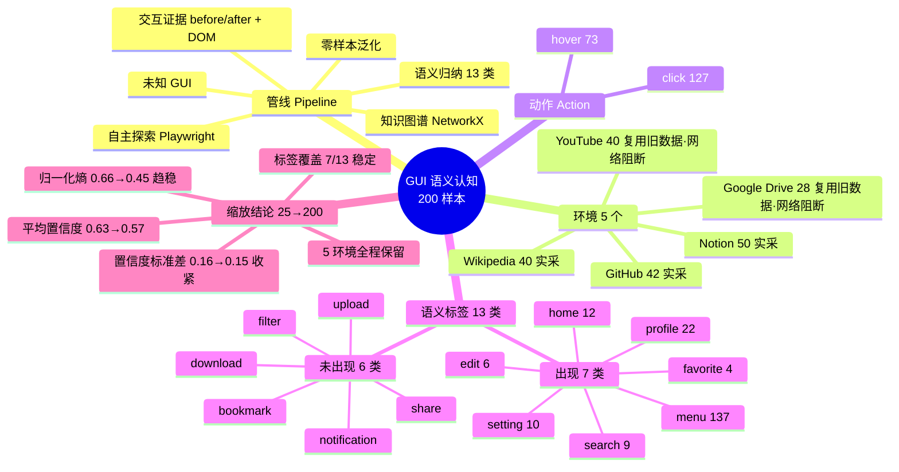

## 二、数据流（Mermaid 流程图）

---

## 三、核心结果图片（点击可看大图）

### 1. 数据集统计
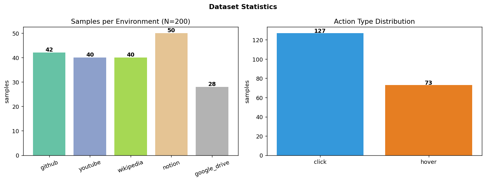

### 2. 语义类别分布（13 类中出现 7 类）
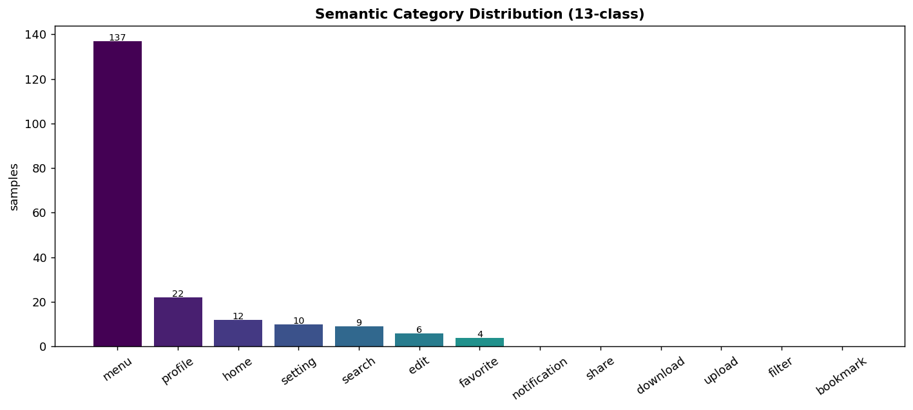

### 3. 跨环境语义分布
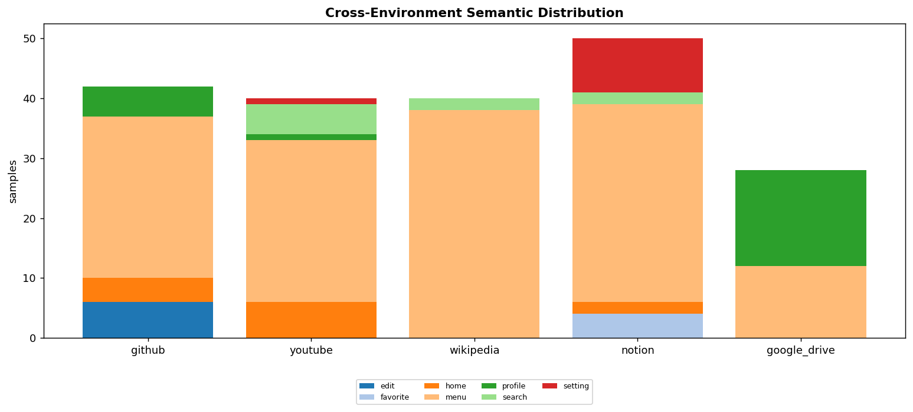

### 4. 置信度分布
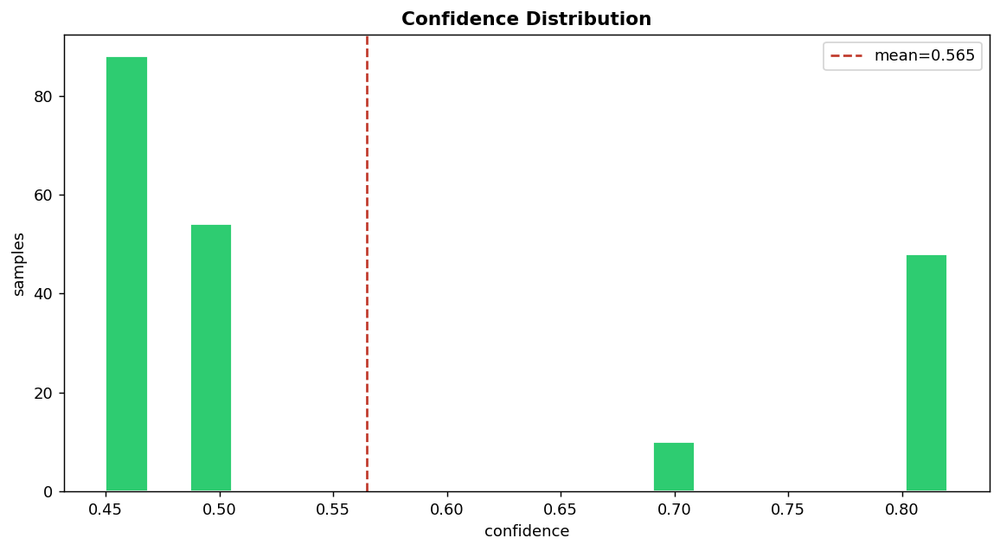

### 5. 缩放曲线 25 → 200（稳定性 & 覆盖率）
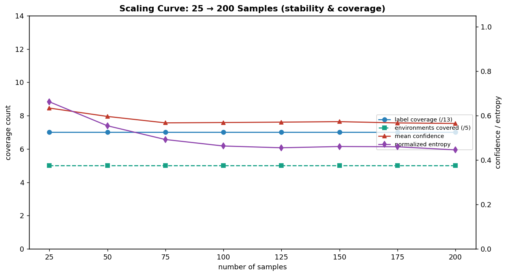

### 6. 知识图谱（思维导图式本体）
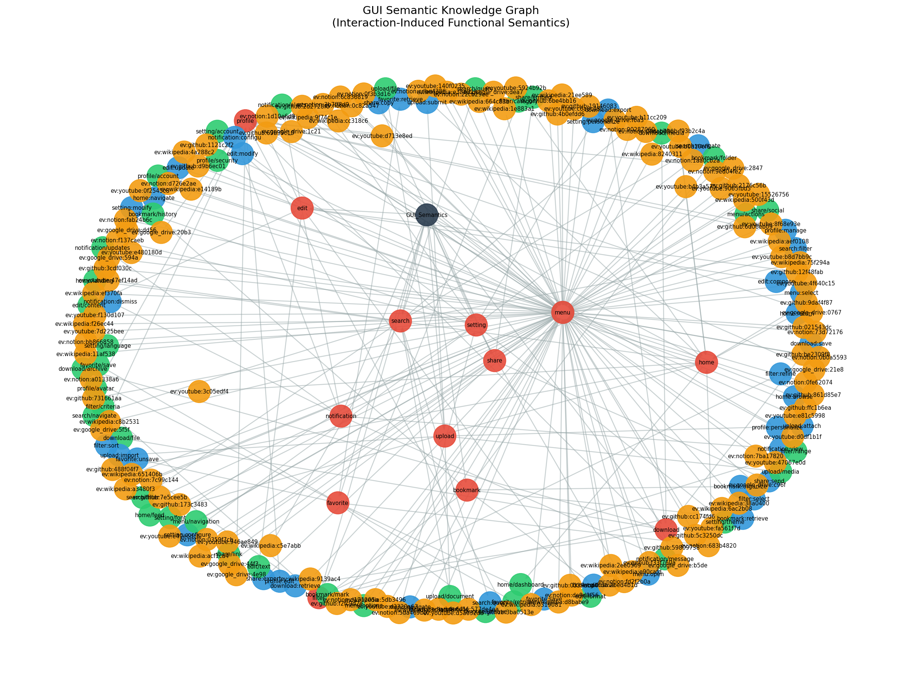

### 7. Before / After 交互网格
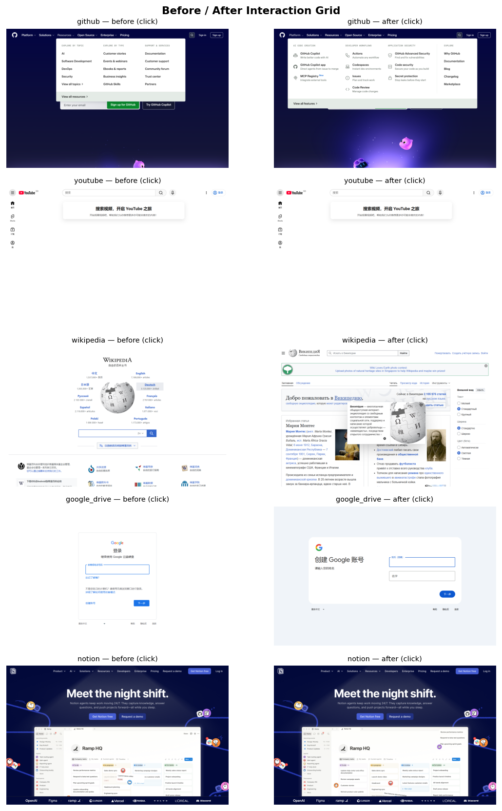

### 8. 语义示例网格
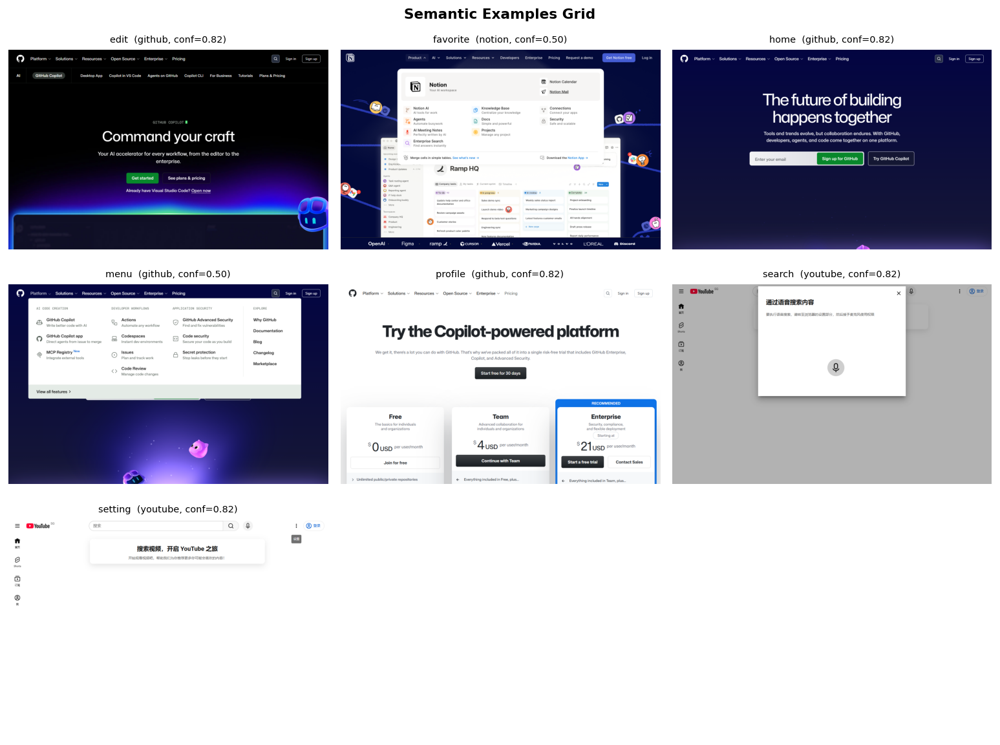

### 9. 失败 / 低证据样例
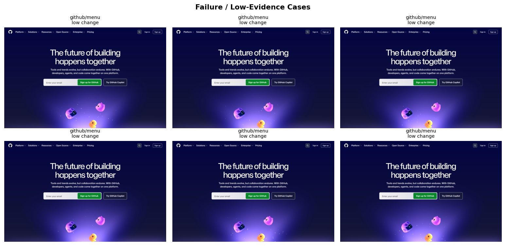

### 10. 零样本泛化 Demo
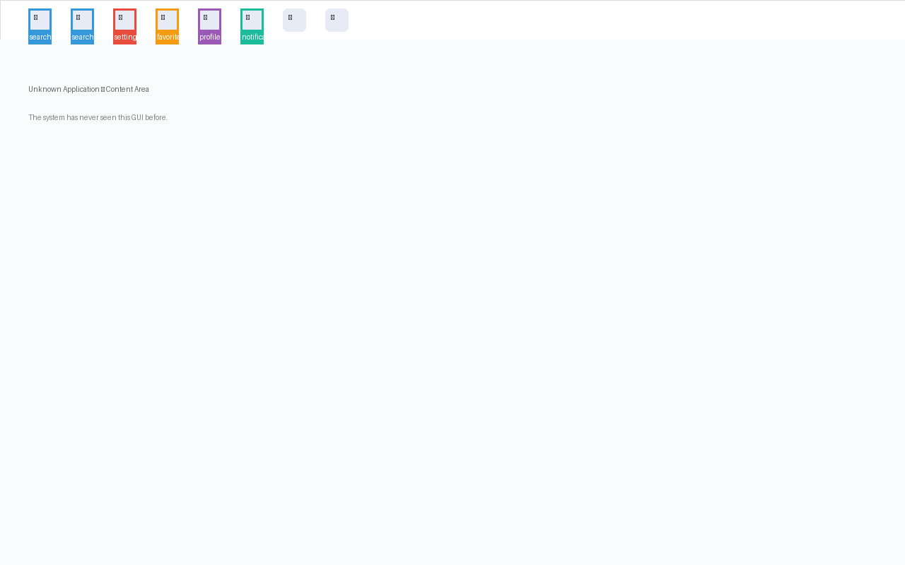

---

## 四、文件位置速查

| 类型 | 路径 |
|------|------|
| 200 样本（严格 schema） | `dataset/processed/samples.jsonl` |
| 管线轨迹 | `dataset/processed/trajectories.jsonl` |
| 元素级语义 | `results/semantics.json` |
| 缩放指标 | `dataset/processed/scaling_metrics.json` |
| 10 张要求图片 | `figures/*.png` |
| 知识图谱 | `semantic_graph/semantic_knowledge_graph.png` |
| 缩放分析 | `reports/scaling_analysis.md` |
| 数据/实验/PPT 报告 | `reports/dataset_summary.md` · `experiment_analysis.md` · `ppt_material.md` |
| 本思维导图 | `reports/mindmap.md` |

> 说明：YouTube / Google Drive 在采集网络下被阻断（`ERR_CONNECTION_CLOSED`），
> 这两个环境复用既有原始交互；其余三站为本机实采。menu 占主导与「未登录落地页
> 以导航链接为主」一致；登录态可surface更多类别（notification/share/upload 等）。
